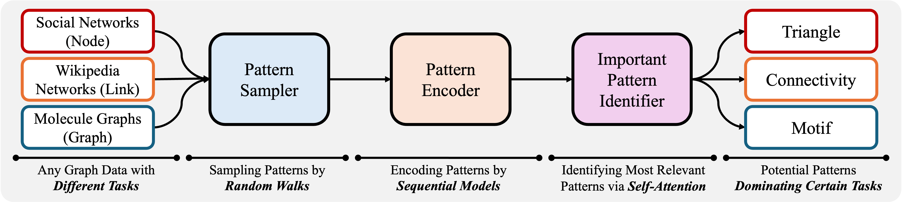

# Beyond Message Passing: Neural Graph Pattern Machine (GPM)

<div align='center'>

[](https://pytorch.org/get-started/locally/)
[](https://pytorch-geometric.readthedocs.io/en/latest/install/installation.html)

[](https://arxiv.org/abs/2501.18739)
[](https://github.com/zehong-wang/G2PM)


</div>

## 📝 Description

This is the official implementation of our ICML'25 paper [Beyond Message Passing: Neural Graph Pattern Machine](https://arxiv.org/abs/2501.18739). GPM represents a significant step towards next-generation graph learning backbone by moving beyond traditional message passing approaches.

### Key Features
- 🔍 Direct learning from graph substructures instead of message passing
- 🚀 Enhanced ability to capture long-range dependencies
- 💡 Efficient extraction and encoding of task-relevant graph patterns
- 🎯 Superior expressivity in handling complex graph structures

### Framework Overview



GPM's workflow consists of three main steps:
1. Pattern extraction using random walk tokenizer
2. Pattern encoding via sequential modeling
3. Pattern processing through transformer encoder for downstream tasks

## 🛠️ Installation

### Prerequisites
- CUDA-compatible GPU (24GB memory minimum, 48GB recommended)
- CUDA 12.1
- Python 3.9+

### Setup
```bash
# Create and activate conda environment
conda env create -f environment.yml
conda activate GPM

# Install DGL
pip install dgl -f https://data.dgl.ai/wheels/torch-2.4/cu121/repo.html

# Install PyG dependencies
pip install pyg_lib torch_scatter torch_sparse torch_cluster torch_spline_conv -f https://data.pyg.org/whl/torch-2.4.0+cu121.html
```

## 🚀 Quick Start
The code of GPM is presented in folder `/GPM`. You can run `main.py` and specify any dataset to run experiments. To ensure reproducability, we provide hyper-parameters in `config/main.yaml`. You can simply use command `--use_params` to set tuned hyper-parameters. 

### Basic Usage
```bash
# Run with default parameters
python GPM/main.py --dataset computers --use_params
```

### Supported Tasks & Datasets

1. **Node Classification**
   - `cora_full`, `computers`, `arxiv`, `products`
   - `wikics`, `deezer`, `blog`, `flickr`, `flickr_small`

2. **Link Prediction**
   - `link-cora`, `link-pubmed`, `link-collab`

3. **Graph Classification**
   - `imdb-b`, `collab`, `reddit-m5k`, `reddit-m12k`

4. **Graph Regression**
   - `zinc`, `zinc_full`

We also provide the interfaces of other widely used datasets like 
`photo`, `physics`, `reddit`, etc. Please check the datasets in `GPM/data/pyg_data_loader.py` for details. 


## 🔧 Configuration Options

### Training Parameters
- `--use_params`: Use tuned hyperparameters
- `--dataset`: Target dataset name
- `--epochs`: Number of training epochs
- `--batch_size`: Batch size
- `--lr`: Learning rate
- `--split`: Data split strategy (`public`, `low`, `median`, `high`)

### Model Architecture
- `--hidden_dim`: Hidden layer dimension
- `--heads`: Number of attention heads
- `--num_layers`: Number of Transformer layers
- `--dropout`: Dropout rate

### Pattern Configuration
- `--num_patterns`: Number of patterns per instance
- `--pattern_size`: Pattern size (random walk length)
- `--multiscale`: Range of walk lengths
- `--pattern_encoder`: Pattern encoder type (`transformer`, `mean`, `gru`)

For complete configuration options, please refer to our code documentation.

## 🔄 Domain Adaptation

Run domain adaptation experiments using:
```bash
python GPM/da.py --source acm --target dblp --use_params
```

Supported domain pairs:
- `acm -> dblp`, `dblp -> acm`
- `DE -> {EN, ES, FR, PT, RU}`

## 📂 Repository Structure
```
└── GPM
    ├── GPM/              # Main package directory
    │   ├── data/         # Data loading and preprocessing
    │   ├── model/        # Model architectures
    │   ├── task/         # Task implementations
    │   ├── utils/        # Utility functions
    │   ├── main.py       # Main training script
    │   └── da.py         # Domain adaptation script
    ├── config/           # Configuration files
    ├── assets/           # Images and assets
    ├── data/             # Dataset storage
    ├── patterns/         # Extracted graph patterns
    └── environment.yml   # Conda environment spec
```

## 📚 Citation

If you find this work useful, please cite our paper:

```bibtex
@inproceedings{wang2025gpm,
  title={Beyond Message Passing: Neural Graph Pattern Machine},
  author={Wang, Zehong and Zhang, Zheyuan and Ma, Tianyi and Chawla, Nitesh V and Zhang, Chuxu and Ye, Yanfang},
  booktitle={Forty-Second International Conference on Machine Learning},
  year={2025}, 
}

@article{wang2025neural,
  title={Neural Graph Pattern Machine},
  author={Wang, Zehong and Zhang, Zheyuan and Ma, Tianyi and Chawla, Nitesh V and Zhang, Chuxu and Ye, Yanfang},
  journal={arXiv preprint arXiv:2501.18739},
  year={2025}
}
```

## 👥 Authors

- [Zehong Wang](https://zehong-wang.github.io/)
- [Zheyuan Zhang](https://jasonzhangzy1757.github.io/)
- [Tianyi Ma](https://tianyi-billy-ma.github.io/)
- [Nitesh V Chawla](https://niteshchawla.nd.edu/)
- [Chuxu Zhang](https://chuxuzhang.github.io/)
- [Yanfang Ye](http://yes-lab.org/)

For questions, please contact `zwang43@nd.edu` or open an issue.

## 🙏 Acknowledgements

This repository builds upon the excellent work from:
- [PyG](https://github.com/pyg-team/pytorch_geometric)
- [OGB](https://github.com/snap-stanford/ogb)
- [VQ](https://github.com/lucidrains/vector-quantize-pytorch)

We thank these projects for their valuable contributions to the field.